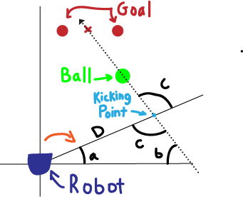
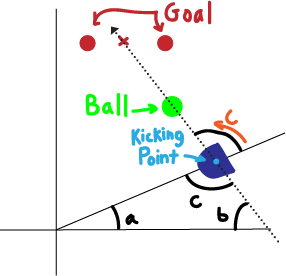

# Robot Soccer

Anna Buchele and Nina Tchirkova

# Project Overview

The goal of this project was to make a robot "kick" a soccerball. Our stretch goal was to have the robot kick a ball into a soccer goal. We broke this challenge into 3 parts, finding the position of the ball relative to the robot, finding the positon of the middle of the goal relative to the robot, and navigating the robot so that it positions itself correctly to kick the ball into the goal.

## Part 1: Locate the Ball

The problem of locating the ball in the room can be broken down into the problem of identifying a ball in an image and then determining how its size and location in the image actually relates to its postion relative to the camera. 

To identify the ball in the image, we used the Python OpenCV library. In essence our program looks for the largest green object and then identifies it as the ball. To reduce the risk of misidentifying other green objects as the ball, our program also uses Hough Circle identification. If an object is both the largest green object and round, it is identified as the ball. From this, we can get the x and y coordinates of the ball, as well as the diameter. Once the diameter of the ball is known in pixels, its location in the real world can be identified. The specific math for this operation is described in Blog 2.

Once the distance and angle of the ball were known, we were able to program the robot to approach the ball and kick it. 

## Part 2: Locate the Goal
For the identification of the goal, we used a similar method as the ball identification. The goal was marked by two red cups, with the goal of kicking the ball between them. For this, we used blob detection and largest contour selection, like with the ball. Unfortunately, red is an even more common color to find in the world than green, so we needed a secondary method to prevent false positives. To do this, we used shape identification using vertices. By counting the number of vertices on the contour, we were able to remove most false positives. The reason for this is that most red objects that would find their way into our frame were irregularly shaped (clothing or other misc objects). These objects would have contours with many vertices. However, our cups reliably had either four or five, depending on the angle, lighting, and distance. This allowed us to combine our blob detection with detection of vertices to reliably find the cups. 

Once the cups are found, our program calculates the midpoint between the cups, and marks that as the goal. The distance is calculated using the pixel height of the cups. If only one cup is seen, we still mark that as the goal, as hopefully in the approach we will begin to see the second cup.

## Part 3: Navigate the Robot to kick

In order for the robot to kick the ball into the goal, it needed to get behind the ball on the line that the ball and center of the goal form. 

To do this, the distance and angle of the ball and goal (essentially their polar coordinates) were turned into cartesian coordinates on the robots reference frame. Then the point that was enough away from the ball to give it a kicking distance and on the kicking line was found. Finally, the robot was directed towards that point. 

Following the image above, the robot needed to turn the complement of angle a.

Then move distance D.

And finally turn angle C to be ready to kick.

# System Architecture

The architecture of our system is a state machine, where the robot is either looking for the ball, positioning itself to kick the ball, or kicking the ball. The function look_for_ball is a ros timer callback function. Each cycle, find_goal attempts to find a goal and find_ball attempts to find a a ball. If both are found, get_in_position directs the ball to its kicking position. Finally, the state is changed to HIT_BALL and the robot switches into an aggressive kicking mode. After kicking the ball, the robot stops and backs up slightly in order to see where the ball goes. Then, it gets ready to kick the ball again! 

Most of our code is located in robot_soccer.py and the state of the robot is controlled by look_for_ball. We have many helper functions that work to process the image, move the robot, and perform calculations.

# Blog 2
### 12/7/2018

Like everything ever in engineering, calibration turned out to be harder than expected. Calibration is necessary because from an image, the program needs to accurately determine the angle away an object is and its distance away too. For these values to be determined accurately, it is necessary to know the focal length, and the focal length is determined by calibrating the camera. After trying many methods we found a ROS package that helps with calibrating a camera by providing a GUI (see below). By giving the actual size of the checkerboard to the program, it was able to get the necessary calibration values by having the checkerboard be in different locations and orientations.

Once the program was done, it outputted a k matrix which contained the focal length. If given the coordinates of a pixel, there is a distance X of how far left or right that pixel is, a distance Y of how far up or down that pixel is, and a distance Z of how far forward the pixel. (See image below).

For this project we only really care about X and Z because the robot stays at a constant height. Given the actual diameter of the ball in meters, the width in pixels and the focal length, it is possible to calculate Z. Z = 2 * focal length * diameter / width. Then to calculate X, the x coordinate of the pixel of the center of the ball is needed as well as the x offset (Cx) which is given in the K matrix. The equation is X = 2(xp - Cx)/focal length. X and Z could also be used to calculate the angle of the ball to the camera using arctan2. 

Another improvement we made was to the recognition of the ball in the image. Our previous version used a mask and blob detector to find the green ball, which usually worked, but the bounds of the ball found were less accurate than we felt they could be. In addition, using blob detection meant that our system would mistake any green object for the ball if the ball was not in the frame, or mistake larger green objects for the ball even if the ball was in frame. So, we combined the blob detector with a circle detector. Our system now finds all the circles in the image, and then checks to see which of those circles is in approximately the same location as a green blob. This helps filter out green objects which are not balls. We also more finely tuned the thresholds in both the blob detector and the circle detector to more closely match the color and size of the ball.

# Blog 1
### 11/30/2018

We started our work for this project by scaffolding it into many parts and coming up with an minimum viable product. Our minimum viable product is to have a robot recognize a ball and kick it in a certain specified direction. To do this, we need to be able to recognize a ball, determine what angle and distance it is from the robot, and then approach it at a specified angle. So far we are able to recognize a ball. However, the angle we detect it is from us is not completely accurate so then we approach it at the wrong angle as well. Our stretch goal for this project is to also detect a goal and have the robot “kick” the ball into the goal. This involves determining at what angle the goal is from the robot and then kicking the ball in that direction.

Our first goal for this project was to successfully detect the presence of a ball. We used a green and black soccer ball, [PHOTO] for easy differentiation from the outside environment. To detect it, we used code from a prior similar project, which implemented a simple OpenCV color mask with blob detection. This did a pretty good job of detecting and localizing the ball, but it didn’t work in some situations. Occasionally the detector would find a wall, or a window, and decide that it was the ball. With some more testing and visualization, we re-tweaked the mask upper and lower bounds to more closely match the color of the ball, and this appears to have solved the issue. The bounding box is smaller and more accurately aligned to the ball as well, which is a nice bonus. Our mask and an image of the found ball can be seen below. [PHOTO]

The next goal for this project was to drive towards a found ball. This requires two things: successfully localizing the correct angle of the ball, and correctly going to a prescribed angle and distance. Prior implementations on our robots had used time and speed-based movement tracking (e.g. we are moving at 0.5 meters per second, and we moved for 1 second, so therefore we have moved 0.5 meters), but we weren’t sure that this method would be quite accurate enough for a precise angular measurement. So, we implemented movement tracking using odometry information, and found that to be very accurate. We had a small bug with going to a prescribed angle, as the signs on the image angle (left of image being a negative angle, and right of image being a positive angle) were the opposite of the angle signs of our robot. However, once we found this issue, fixing it was very simple. We then found another problem, which we are still working on: the angle found for the direction of the ball does not match up with the actual angle the robot should drive in order to get there. We think this is due to not calibrating the camera, so that will be our next step.

